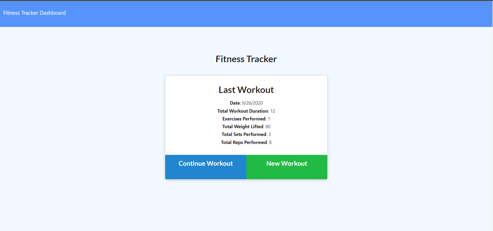
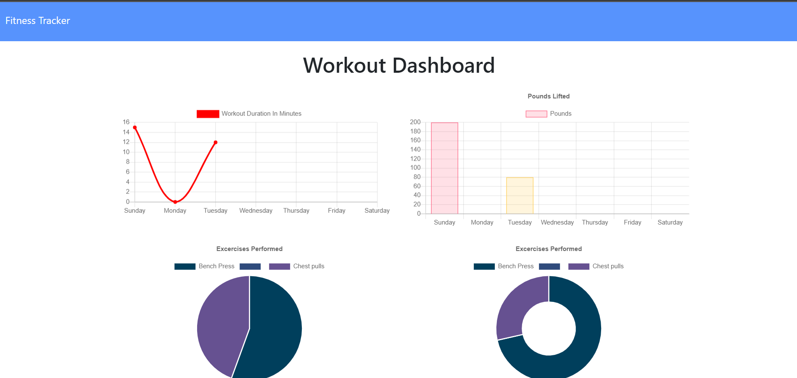

# Unit 17 Nosql Homework: Workout Tracker

A workout tracker created using express and stores and retrieves data from a database created using MongoDB.

## User Story

- As a user, I want to be able to view create and track daily workouts. I want to be able to log multiple exercises in a workout on a given day. I should also be able to track the name, type, weight, sets, reps, and duration of exercise. If the exercise is a cardio exercise, I should be able to track my distance traveled.

## Application URL

https://hidden-taiga-93596.herokuapp.com/

## Video Demo

- Below are screenshots of what the deployed application looks like

